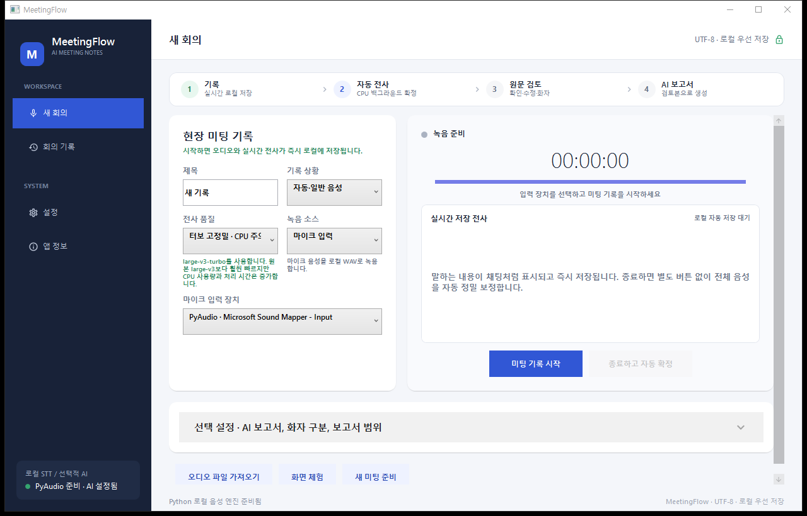
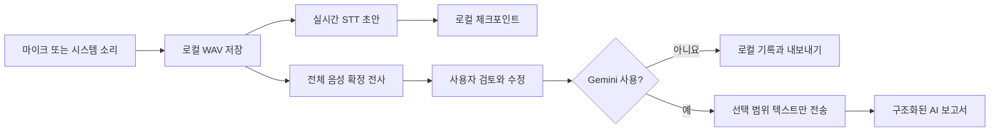

# MeetingFlow


회의 봇을 초대하지 않고 Windows PC에서 마이크 또는 시스템 소리를 녹음한 뒤, 오픈소스 STT로 먼저 받아쓰고 사용자가 검토한 텍스트만 선택적으로 Gemini가 정리하는 로컬 우선 회의 기록 앱입니다.

> 녹음과 STT는 로컬에서 처리합니다. Gemini를 사용할 때도 오디오가 아니라 사용자가 검토한 지정 범위의 텍스트만 전송합니다.



## 왜 MeetingFlow인가요?

- **Local-first:** 오디오, 실시간 초안, 확정 전사를 내 PC에 우선 저장합니다.
- **Review-first AI:** AI가 잘못 들은 문장을 사실처럼 요약하기 전에 사용자가 원문을 검토합니다.
- **No meeting bot:** Teams, Zoom, YouTube 등 PC에서 재생되는 소리를 WASAPI 루프백으로 기록할 수 있습니다.
- **Open-source STT:** faster-whisper/CTranslate2를 기본으로 사용하고 Gemini는 보고서 작성에만 선택적으로 사용합니다.
- **Failure tolerant:** Gemini 연결이 끊겨도 녹음과 전사는 보존되며 나중에 다시 정리할 수 있습니다.

## 핵심 기능

- PyAudio 마이크 녹음과 NAudio WASAPI 시스템 소리 루프백
- 녹음 중 실시간 전사 초안과 로컬 체크포인트 저장
- faster-whisper CPU `int8` 전사와 문장별 진행률
- 한국어, 영어, 중국어, 일본어, 독일어, 프랑스어 등 고정·자동·혼합 언어 모드
- 뉴스, 기술 검토, 인터뷰, 강의, 고객 상담 등 콘텐츠 프로필
- 원본 STT, 사용자 검토본, AI 보고서 분리 저장
- 선택형 pyannote 화자 분리와 화자 수 고정
- 12종 Gemini 보고서 템플릿과 시간 범위 지정
- AI 연결 실패 작업 저장과 재처리
- 검색, Markdown 내보내기, UTF-8 저장
- API 키와 Hugging Face 토큰 Windows DPAPI 암호화

## 처리 흐름



## STT 품질 프리셋

| 프리셋 | 확정 모델 | CPU 스레드 상한 | 최초 다운로드 | 용도 |
|---|---|---:|---:|---|
| 빠른 확인 | `small` | 6 | 약 0.48GB | 긴 회의의 빠른 초안 |
| 고정밀 권장 | `medium` | 8 | 약 1.53GB | 일반 한국어 회의·뉴스 |
| 터보 고정밀 | `large-v3-turbo` | 10 | 약 1.62GB | 정확도와 속도 우선 |

모델은 최초 한 번만 내려받습니다. 다운로드 단계와 실제 전사 단계는 UI에서 별도로 표시됩니다. 큰 모델은 CPU와 메모리를 많이 사용하므로 장시간 회의는 `medium` 또는 `small`부터 권장합니다.

## 요구 사항

- Windows 10 또는 Windows 11 x64
- [.NET 8 Desktop Runtime](https://dotnet.microsoft.com/download/dotnet/8.0)
- Python 3.13
- 마이크 또는 Windows 오디오 출력 장치
- 모델 최초 다운로드를 위한 인터넷 연결
- Gemini 보고서를 사용할 경우에만 Gemini API 키

AMD GPU나 NVIDIA CUDA가 없어도 CPU로 동작합니다.

## 빠른 시작

```powershell
git clone https://github.com/ko9ma7/MeetingFlow.git
cd MeetingFlow
powershell -ExecutionPolicy Bypass -File .\scripts\setup-python.ps1
dotnet run --project .\MeetingFlow.App\MeetingFlow.App.csproj
```

릴리스 ZIP을 사용하는 경우 압축을 푼 폴더에서 Python 환경을 먼저 준비합니다.

```powershell
powershell -ExecutionPolicy Bypass -File .\scripts\setup-python.ps1
.\MeetingFlow.exe
```

자세한 사용 절차는 [사용 가이드](docs/USAGE.md)를 확인하세요.

## Gemini 설정

Gemini는 필수가 아닙니다. 로컬 녹음과 전사는 API 키 없이 사용할 수 있습니다.

1. 앱의 `설정`에서 Gemini API 키를 입력합니다.
2. 연결 테스트를 실행합니다.
3. 보고서 언어와 기본 템플릿을 선택합니다.
4. 확정 전사본을 검토한 뒤 AI 보고서를 생성합니다.

API 키는 Windows 사용자 계정의 DPAPI로 암호화해 로컬에 저장합니다. 키를 소스 코드나 Git 저장소에 넣지 마세요.

## 데이터 저장 위치

| 데이터 | 기본 위치 |
|---|---|
| 설정 | `%LOCALAPPDATA%\MeetingFlow\settings.json` |
| 회의 기록 | `%LOCALAPPDATA%\MeetingFlow\Meetings\` |
| 녹음 오디오 | `%LOCALAPPDATA%\MeetingFlow\Audio\` |
| STT 모델 | `%LOCALAPPDATA%\MeetingFlow\Models\faster-whisper\` |

이 경로의 데이터는 Git에 포함되지 않습니다.

## 현재 한계

- 설치 프로그램과 자동 업데이트는 아직 제공하지 않습니다.
- 실시간 초안은 확정본이 아니며 녹음 종료 후 전체 전사 결과로 교체됩니다.
- 화자 분리는 pyannote 설치와 Hugging Face 토큰이 필요하고 CPU에서 오래 걸릴 수 있습니다.
- 겹쳐 말하기, 멀리 있는 마이크, 배경 음악, 작은 음량에서는 정확도가 낮아질 수 있습니다.
- 30분 이상 장시간 녹음의 복구·메모리 테스트가 더 필요합니다.
- Notion, Teams, Slack, 캘린더 직접 연동은 아직 구현되지 않았습니다.

## 로드맵

### 안정화

- 장시간 녹음의 체크포인트 복구와 디스크 관리
- 실시간 전사 큐 재시작과 중복 구간 병합 개선
- 마이크와 시스템 소리 동시 믹스 또는 듀얼 채널
- 모델 다운로드 진행률과 예상 남은 시간

### 품질

- 문장·단어별 신뢰도와 낮은 신뢰도 강조
- 화자 이름 지정과 선택적 음성 프로필 재사용
- 프로젝트별 용어집과 한국어 고유명사 평가 세트
- WhisperX 및 다른 로컬 STT 엔진 어댑터

### 공유와 상용화

- MSIX 설치 프로그램과 코드 서명
- DOCX, PDF, HTML 내보내기
- Notion, Teams, Slack, Outlook 연동
- 팀 권한, 보존 정책, 감사 로그

상세 내용은 [제품 리뷰와 로드맵](docs/PRODUCT_REVIEW_AND_ROADMAP.md)을 참고하세요.

## 빌드와 테스트

```powershell
dotnet build .\MeetingFlow.slnx -c Release
dotnet test .\MeetingFlow.slnx -c Release
.\python-stt\.venv\Scripts\python.exe .\python-stt\meetingflow_stt.py health
```

현재 자동 테스트는 저장, 인코딩, 보고서 파싱, 시간 범위, 언어 매핑, 반복 환각 필터를 검증합니다. 실제 녹음이나 개인 전사 데이터는 저장소에 포함하지 않습니다.

## 개인정보와 녹음 동의

회의를 녹음하기 전에 참가자 동의와 지역 법규, 회사 보안 정책을 확인하세요. 민감한 녹음과 전사 파일을 공개 이슈에 첨부하지 마세요. 보안 문제는 [보안 정책](SECURITY.md)을 따라 신고해 주세요.

## 기여

버그 제보와 기능 제안은 환영합니다. 개발 환경과 제출 기준은 [기여 가이드](CONTRIBUTING.md)를 확인하세요.

## 라이선스

[MIT License](LICENSE)
